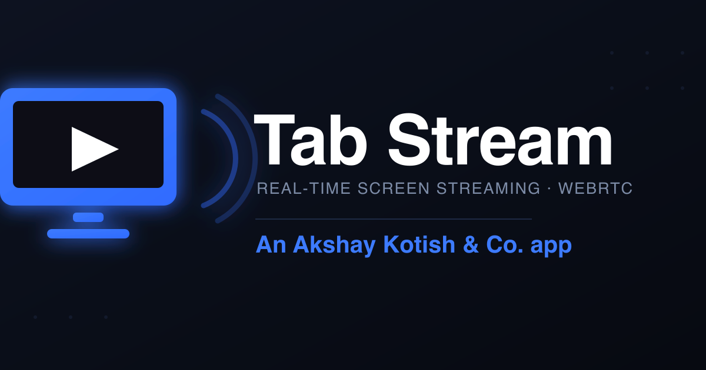

<p align="center">
  
</p>

<h1 align="center">Tab Stream</h1>

<p align="center">
  Real‑time <b>tab / screen streaming</b> to any device on your network — sub‑second latency over WebRTC (UDP). <br>
  A Node.js dashboard broadcasts; a fullscreen Android launcher (or any browser) watches by IP.
</p>

<p align="center">
  <a href="https://github.com/akshaykotish/tab-stream/releases/latest/download/TabStream.apk">
    
  </a>
  &nbsp;
  
  
</p>

---

## ⬇ Download the app

**[Download TabStream.apk →](https://github.com/akshaykotish/tab-stream/releases/latest/download/TabStream.apk)**

It's a fullscreen **launcher**: install it and the device boots straight into your stream — no buttons, no chrome, just the picture. To change the stream address, **tap the top‑left corner 5× quickly**.

> Android may warn about installing outside the Play Store. Enable **Settings → Apps → Special access → Install unknown apps** for your browser/file manager, then open the APK.

To make it the device's home screen: **Settings → Apps → Default apps → Home app → Tab Stream**.

### 📺 Android TV

The app installs and runs on Android TV / Google TV — it shows on the TV home row (Leanback) with its own banner, and works with no touchscreen. To open the settings box with a remote: press **MENU**, or press **OK/center 5× quickly**.

### 🔌 Auto-start on boot

- **Guaranteed:** set Tab Stream as the **Home app** (Settings → Apps → Default apps → Home app). The system then launches it automatically on every boot. This is the recommended kiosk setup.
- **Fallback:** a `BootReceiver` also tries to launch on `BOOT_COMPLETED` for non-home installs. (Note: Android 12+ restricts background activity starts, so the Home-app method above is the reliable one.)

---

## ⬇ Get the server

The server is the dashboard that broadcasts and relays the stream. Three ways to get it — pick one:

| Option | Needs | Best for |
|--------|-------|----------|
| **A. Standalone binary** | nothing | just run it, no setup (macOS Apple-Silicon) |
| **B. Server zip** | Node.js 18+ | any OS, no `npm install` (deps bundled) |
| **C. From source** | Node.js 18+ + git | developers / customizing |

### A. Standalone binary — no Node.js needed

**[Download tabstream-server-macos-arm64 →](https://github.com/akshaykotish/tab-stream/releases/latest/download/tabstream-server-macos-arm64)**

```bash
chmod +x tabstream-server-macos-arm64
./tabstream-server-macos-arm64
```

> macOS Gatekeeper may block it the first time → **System Settings → Privacy & Security → Open Anyway**, or run `xattr -d com.apple.quarantine ./tabstream-server-macos-arm64`.
> The binary serves **HTTP** (broadcast from `http://localhost:3000/`). For HTTPS broadcast from other devices, use option B or C and run `make-certs.sh`.

### B. Server zip — Node.js, no install step

**[Download TabStream-server.zip →](https://github.com/akshaykotish/tab-stream/releases/latest/download/TabStream-server.zip)**

1. Install **Node.js 18+** → https://nodejs.org (one time).
2. Unzip `TabStream-server.zip`.
3. Run it — dependencies are already bundled:
   - **macOS / Linux:** `./start.sh`  (or double-click)
   - **Windows:** double-click `start.bat`
   - **Manual:** `node server.js`

### C. From source

```bash
git clone https://github.com/akshaykotish/tab-stream.git
cd tab-stream/server
npm install
npm start
```

**Prerequisites:** Node.js 18+ (and git). `npm install` pulls `express` + `ws`.

### 🤖 Compile with an AI assistant

Don't want to figure out the steps yourself? **[PROMPTS.md](PROMPTS.md)** has copy‑paste prompts for **Claude**, **ChatGPT**, and **Gemini** that walk you through compiling the server binary and the Android APK on your exact OS.

---

## How it works

```
 Broadcaster (browser)            Node server               Viewer (Android app / browser)
 ┌──────────────────┐   signaling  ┌─────────────┐  signaling  ┌──────────────────────────┐
 │ shares a tab/screen ├──WebSocket──┤  relays SDP ├──WebSocket──┤ receives & plays fullscreen │
 │  getDisplayMedia    │             │  + ICE only │             │   (no buffer, auto-play)   │
 └─────────┬──────────┘             └─────────────┘             └────────────┬─────────────┘
           └──────────────── WebRTC media, peer‑to‑peer over UDP ────────────┘
```

The server only brokers the handshake. Video flows **directly** browser‑to‑device over UDP, so it never round‑trips through the server.

---

## Run it locally

### 1. Start the server

```bash
cd server
npm install
npm start
```

It prints your URLs, e.g.:

```
Broadcast:  http://localhost:3000/            (this machine)
            https://192.168.1.42:3443/        (any device — accept cert once)
Watch:      http://192.168.1.42:3000/view.html
```

### 2. Broadcast (share a tab/screen)

Screen capture needs a **secure context**, so open the broadcast page one of two ways:

- **From the same machine:** `http://localhost:3000/` ✅ works directly.
- **From any other device:** run `./make-certs.sh` once, restart, then open `https://<your-ip>:3443/` and accept the self‑signed cert warning.

Click **Start sharing**, pick a tab/window/screen, choose a quality (up to 4K), done.

### Stream a local file (buffered, full quality)

Live mode (above) is real‑time but re‑encodes. **File mode** plays a video file at its **original quality, perfectly smooth** — viewers pre‑download a few seconds first, then play.

1. On the dashboard, scroll to **"Stream a local file"**.
2. Add a video — either **choose a file to upload**, or drop files into the server's `server/media/` folder and hit **Refresh**.
3. Set **Pre‑buffer before play** (10–120 s) — how much each viewer downloads before starting.
4. Click **▶ Play** on a file. Every viewer buffers, then plays it in sync‑ish, full quality.
5. **⏹ Back to live** returns viewers to the live screen share.

- **Formats:** `.mp4` / `.webm` / `.mov` play directly with seeking. `.mkv` / `.avi` / `.flv` / `.wmv` are **remuxed to MP4 on the fly** — this needs **ffmpeg** installed (`brew install ffmpeg`). Without ffmpeg, only the native formats play.
- The pre‑buffer is the "download N seconds locally, then stream" behaviour — higher latency than live, but no stutter and no quality loss.

### 3. Watch

Open `http://<your-ip>:3000/view.html` on any phone, laptop, or TV browser on the same network — **or** use the Android app and point it at that URL.

> All devices must be on the **same Wi‑Fi / LAN**. "Stream on an IP" = local network.

---

## Build the Android app from source

Requires Android Studio (or the Android SDK + JDK 17+).

```bash
cd android
cp local.properties.sample local.properties   # then edit sdk.dir
./gradlew assembleDebug
# output: app/build/outputs/apk/debug/app-debug.apk
```

Open `view.html`'s URL in the app via the hidden gesture (top‑left, 5 taps).

## Compile the standalone server binary

**Prerequisites:** Node.js 18+ (npx). The build downloads a base runtime once.

```bash
cd server
npx @yao-pkg/pkg server.js --config pkg.json --output dist/tabstream-server-macos-arm64
```

`pkg.json` bundles `public/**` into the binary. Change the `targets` in `pkg.json` to build for other platforms, e.g. `node22-win-x64`, `node22-linux-x64`, `node22-macos-x64`.

---

## Fixed ports

| Port | Use |
|------|-----|
| **3000** | HTTP — viewers (`/view.html`) and localhost broadcast |
| **3443** | HTTPS — broadcast from other devices |

These are pinned in `server.js` (override with `PORT` / `HTTPS_PORT` env vars). You always connect on `:3000`. WebRTC also opens a **random high UDP port** (e.g. `53593`) for the actual media — that's normal, chosen per session by the OS, and needs no configuration on a LAN.

## Latency

Tuned to keep the viewer essentially frame-synced with the source on a LAN (~50–150 ms):

- **UDP only** — TCP ICE candidates are dropped; media never falls back to a slower transport.
- **Zero jitter buffer** — the viewer sets `jitterBufferTarget = 0` / `playoutDelayHint = 0` and re-asserts it for ~12 s, so frames paint on arrival instead of being held.
- **High network priority** on the sender so media isn't delayed behind other traffic.

## Features

- **Fastest transport** — WebRTC over **UDP**; TCP candidates are filtered out so it never falls back to a slower path.
- **No buffering delay** — viewer jitter buffer is set to 0; frames render the instant they arrive.
- **Android TV ready** — Leanback launcher + banner, no touchscreen required, remote-friendly.
- **Auto-start on boot** — via Home-app mode (recommended) or the boot receiver.
- **HD** — selectable 720p / 1080p / 1440p / 4K with high bitrate so text stays crisp.
- **Audio** — share tab audio, plus a dashboard **🔊 Audio on viewers** checkbox that live‑mutes/unmutes every viewer's output device.
- **File mode** — stream local `.mp4/.mkv/.avi/...` files with a configurable 10–120 s pre‑buffer for smooth, full‑quality, stutter‑free playback (ffmpeg auto‑remuxes non‑MP4).
- **One broadcaster → many viewers**, plus independent channels via `?room=NAME`.
- **Kiosk launcher** — fullscreen, auto‑play, keep‑awake, no on‑screen controls, swallows Back.
- **Zero install for viewers** — any browser on the LAN just opens a URL.

---

## Tech

Node.js · Express · `ws` (WebSocket signaling) · WebRTC · Android (Kotlin, WebView).

---

<p align="center"><b>An Akshay Kotish &amp; Co. app</b></p>
